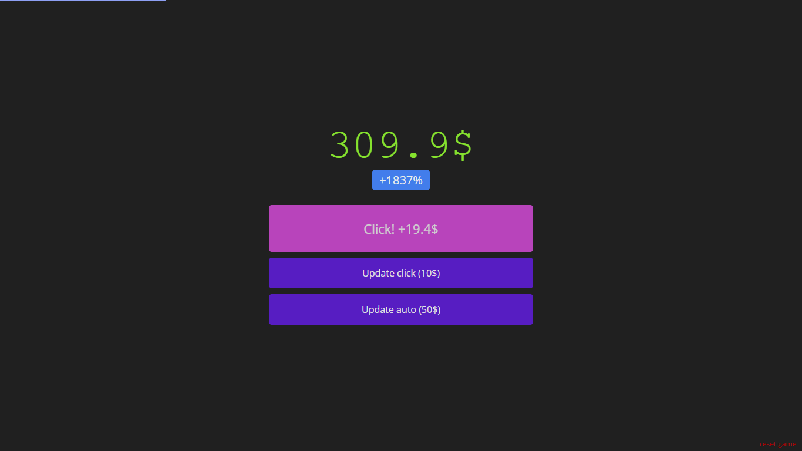
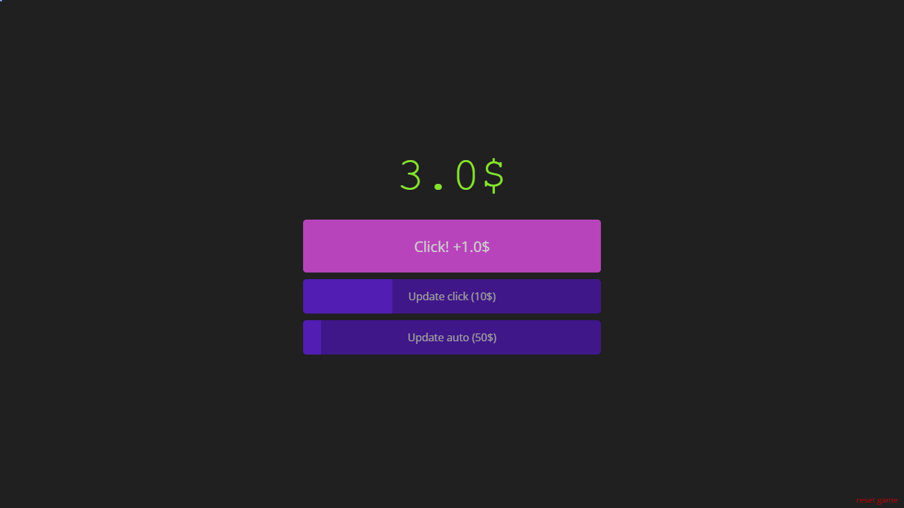
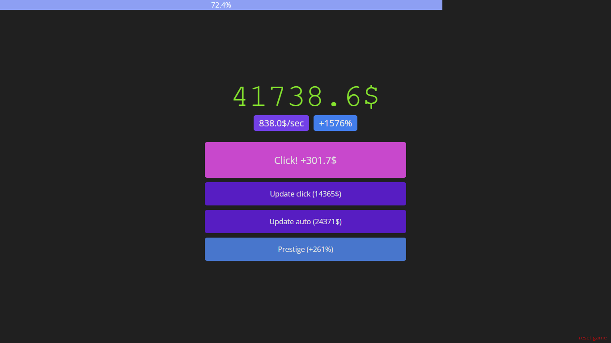

# 💰idle money

### Минималистичный кликер на react.js

 

## Описание

**idle money** - игра, целью которой является набирать очки, кликая по кнопке, и покупать улучшения.

## Установка и настройка

1.  Клонируйте репозиторий с помощью команды:

        git clone https://github.com/demi9ka/idle-money

2.  Перейдите в директорию проекта:

        cd idle-money

3.  Установите зависимости:

        npm install

4.  Запустите проект:

        npm run dev

## Как использовать

После запуска приложения, откройте веб-приложение в браузере по ссылке http://localhost:5173/.

Для увеличения счетчика очков нажимайте на кнопку "click". Вы можете прокачать автоматический доход, который будет начисляться каждую секунду, или улучшить свой клик.

Получив 1500 очков, вы сможете сделать **prestige**, после чего потеряете весь доход и все улучшения, но получите бонус к общему доходу, что ускоряет игру.

Также в правом нижнем углу находится кнопка _reset game_, которая сбрасывает весь прогресс.

Цель игры - набрать максимальное количество очков.

 

## Технологии

</a>

## Авторы

https://github.com/demi9ka

### License

MIT License
